# Project_1 Report

---

## Introduction

To implement object detection, we using Detectron2 framework to achieve. Detectron2 is the framework provided by the Facebook. User can simply customize their ML model and config file, according to own requirement adjust parameters and model structure.

In this project, we will focus on model training with Cityscapes dataset (Pascal VOC format), comparing the performance differences between Backbone ResNet50 and VGG16 in terms of efficiency, accuracy, total loss, and other aspects. Based on the experimental results, we will analyze and summarize the findings to verify the performance of ResNet50 and VGG16.

## **Experimental Setup**

### Detail of the model(Faster R-CNN)

As a variant of Fast R-CNN, the introduction of the Region Proposal Network (RPN) eliminates the need for selective search in specific areas of the feature map, instead performing anchor prediction.

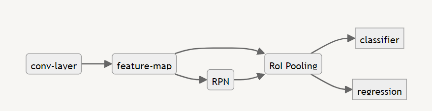

Following is the explanation about RPN and RoI Pooling.

- **RPN**

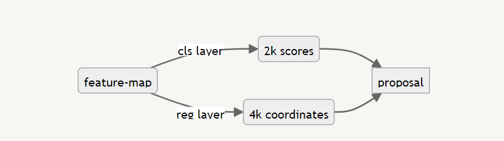
    
    - Initially, for each point on the feature map, 9 anchors (K=9) with different aspect ratios and scales are generated. Thus, the entire image will have width * height * K anchors. These anchors are then fed into the Region Proposal Network (RPN) for anchor prediction. This is done by applying a sliding window (a 3x3 convolutional filter) to each position on the feature map, computing the necessary predictions for each anchor at every location.
    - 會分成 classification 和 regression
        - Classification:
            - Decide the probability of the proposal
            - Compare between anchor and groud-truth box，IoU>0.7 ⇒ P=1
        - Regression:
            - Decide the coordinate of the proposal
            - Using Smooth L1 loss find $t_i$
    - Loss function
    
    $$
    L(\{p_i\}\{t_i\})=\frac{1}{N_{cls}}\sum_i\overbrace{L_{cls}(p_i, p^*_i)}^{\text{Log Loss}}+\lambda\frac{1}{N_{reg}}\sum_ip^*_i\overbrace{L_{reg}(t_i, t^*_i)}^{\text{Smooth L1 loss}}
    $$
    
- **RoI Pooling**
    
    After the RPN generates region proposals, RoI Pooling extracts a fixed-size feature map (e.g., 7x7) for each proposal from the convolutional feature map. This is done by dividing the proposed region into a grid and then applying max pooling within each grid cell. This ensures that each region proposal, regardless of its original size, is transformed into a fixed-size feature map, which can then be fed into fully connected layers for further processing, such as classification and bounding box regression. RoI Pooling allows the model to handle varying sizes of region proposals in a uniform manner, enabling effective and efficient detection of objects at different scales.
    

### Detail of the backbone(ResNet50 and VGG16) and the differences between them

- ResNet50
    
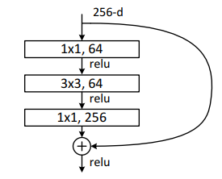
    
    - Basic Idea
        
](md_img/Untitled-2.png)
        
[1512.03385.pdf (arxiv.org)](https://arxiv.org/pdf/1512.03385.pdf)
        
        To avoid gradient vanishing during deep learning, the idea of **Residual Mapping** is proposed. Suppose input is $x$, expected output is $H(x)$. Instead of directly mapping $H(x)$,  the approach transforms it into $F(x)=H(x)-x$, where find the minimum solution of $F(x)=0$ .  Thus, the equation turn into $H(x) = F(x) + x$.  This is called **Shortest Connections, we can get** $H(x)$ very easily and efficiently.
        
    - Bottleneck
        
](md_img/Untitled-3.png)
        
[1512.03385.pdf (arxiv.org)](https://arxiv.org/pdf/1512.03385.pdf)
        
        Since networks with more than 50 layers would require more time and resources, the Bottleneck technique was proposed to save a significant number of parameters. This technique involves using a 1x1 convolution to first reduce the dimensionality and then restore it, allowing the 3x3 convolution in the Bottleneck to process higher-dimensional inputs without needing to read as many parameters. This way, the Bottleneck block reduces computational cost while maintaining the ability to handle high-dimensional data effectively.
        
         
        
- VGG16

](md_img/Untitled-4.png)
    
[VGG-16 | CNN model for Classification and Detection - All about Machine Learning (techcraft.org)](https://blog.techcraft.org/vgg-16-cnn-model-for-classification-and-detection/)
    
    The fatal defect of VGG
    
    - Slow to train
    - Acquire large disk space due to weights are quite large
    
    Due to the depth and the number of FC layer, VGG-Net need lot of storage to store these informations. 
    
    However, in small network architecture, it might have better performance. (ex: SqueezeNet, GoogLeNet, etc.)
    

### Description of the data loading process

```python
from detectron2.data.datasets import register_pascal_voc

cls_names = ('truck', 'car', 'rider', 'person', 'train', 'motorcycle', 'bicycle', 'bus')
register_pascal_voc("my_dataset", '/path/to/Cityscapes_dataset', "trainval", 2007, cls_names)
register_pascal_voc("my_test", '/path/to/Cityscapes_dataset', "test", 2007, cls_names)
```

Using `register_pascal_voc` ’s function `register_pascal_voc` do the data loading.

### Explanation of the evaluation setup

```python
from detectron2.evaluation import PascalVOCDetectionEvaluator, inference_on_dataset

evaluator = PascalVOCDetectionEvaluator("my_test")
val_loader = build_detection_test_loader(cfg, "my_test")
print(inference_on_dataset(predictor.model, val_loader, evaluator))
```

pascal_voc_evaluation.py will print the AP of each class.

```python
for cls_id, cls_name in enumerate(self._class_names):
		lines = predictions.get(cls_id, [""])

    with open(res_file_template.format(cls_name), "w") as f:
			  f.write("\n".join(lines))

    for thresh in range(50, 100, 5):
		    rec, prec, ap = voc_eval(
		        res_file_template,
            self._anno_file_template,
	          self._image_set_path,
            cls_name,
            ovthresh=thresh / 100.0,
            use_07_metric=self._is_2007,
       )
       aps[thresh].append(ap * 100)
                
       print(cls_name)
       res = 0
       for x, cls_x in aps.items():
		       res = res + cls_x[cls_id]
       print("AP: "+str(res/50))
       print("AP50: "+str(aps[50][cls_id]))
       print("AP75: "+str(aps[75][cls_id]))
]))
```

Also using wandb to visualize the parameter and loss changing during the training process

```python
import wandb
wandb.login(relogin=True, key='...')
wandb.init(
            # set the wandb project where this run will be logged
            project="Exercise_1", 
            name="backbone-name",
            sync_tensorboard=True
        )
```

## **Experimental Results**

### Accuracy in each category

- ResNet50
    
    ```bash
    truck
    AP: 18.585841446135568
    AP50: 31.338383838383837
    AP75: 20.745920745920746
    car
    AP: 45.23194129731662
    AP50: 62.661848007180495
    AP75: 50.77474732238093
    rider
    AP: 31.316540238231276
    AP50: 51.69606753022406
    AP75: 30.086574827029832
    person
    AP: 28.690890761499105
    AP50: 50.96133221738626
    AP75: 28.273660903748304
    train
    AP: 11.649944826415416
    AP50: 34.34343434343434
    AP75: 2.02020202020202
    motorcycle
    AP: 20.135225601873593
    AP50: 39.87173943333766
    AP75: 13.203463203463203
    bicycle
    AP: 22.58312610391963
    AP50: 41.96947257013663
    AP75: 19.64384797516233
    bus
    AP: 30.21032909796701
    AP50: 49.33982683982684
    AP75: 31.677622540212635
    OrderedDict({'bbox': {'AP': 26.05047992166978, 'AP50': 45.27276309748876, 'AP75': 24.553254942265}})
    ```
    
- VGG16
    
    ```bash
    truck
    AP: 0.4545454545454546
    AP50: 4.545454545454546
    AP75: 0.0
    car
    AP: 9.039123080572587
    AP50: 25.02996680051936
    AP75: 4.004103925568752
    rider
    AP: 5.098196668128555
    AP50: 13.88888888888889
    AP75: 2.4242424242424243
    person
    AP: 3.327577735590603
    AP50: 11.317384386681901
    AP75: 1.0356731875719216
    train
    AP: 0.0
    AP50: 0.0
    AP75: 0.0
    motorcycle
    AP: 2.7272727272727275
    AP50: 4.545454545454546
    AP75: 4.545454545454546
    bicycle
    AP: 1.1311504589909278
    AP50: 3.54913058699965
    AP75: 0.6993006993006993
    bus
    AP: 3.0303030303030303
    AP50: 9.090909090909092
    AP75: 0.7575757575757575
    OrderedDict({'bbox': {'AP': 3.101021144425486, 'AP50': 8.9958986056135, 'AP75': 1.6832938174642627}})
    
    ```
    

### Visualization of training process

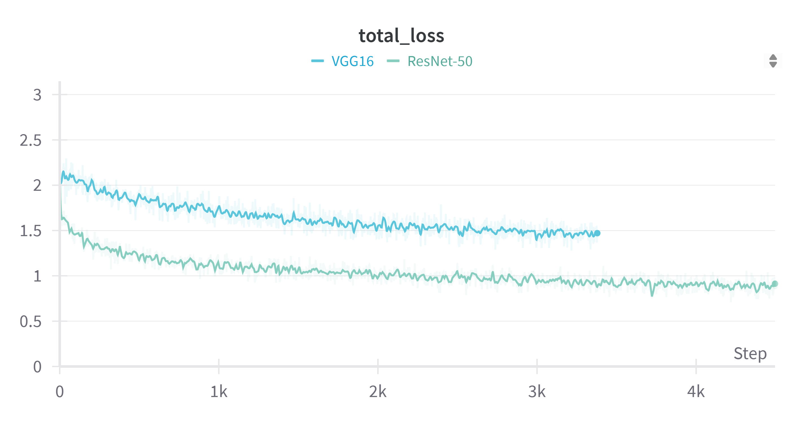

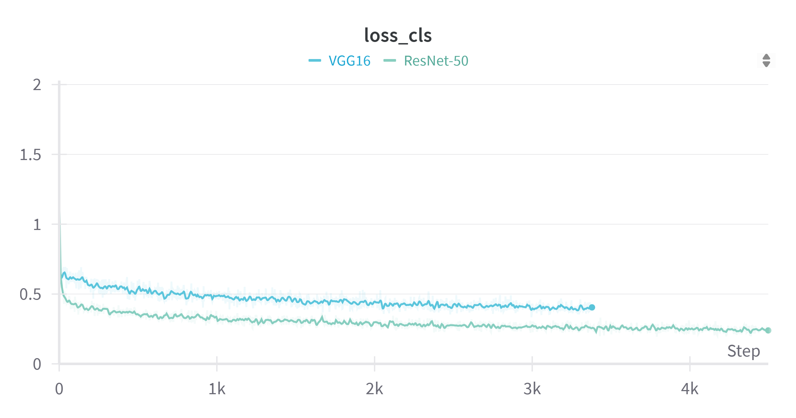

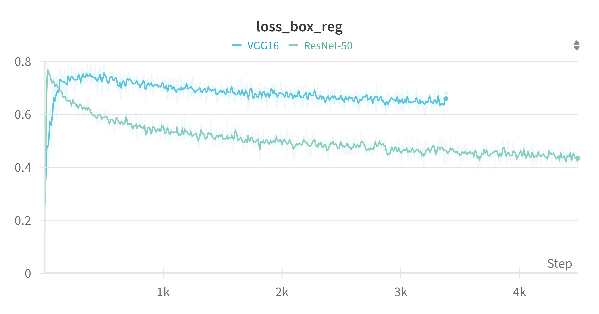

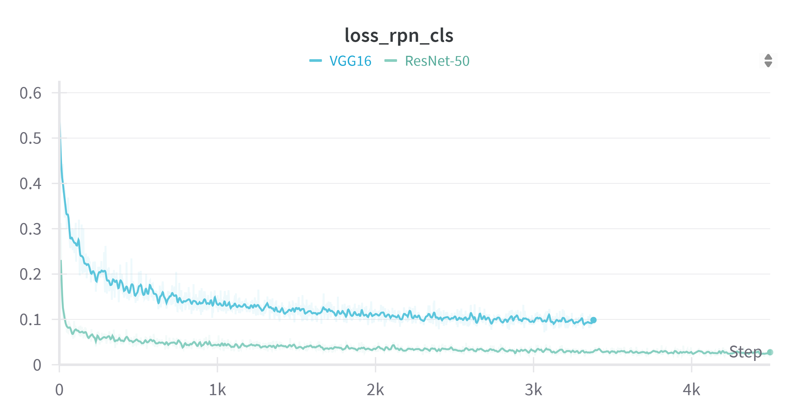

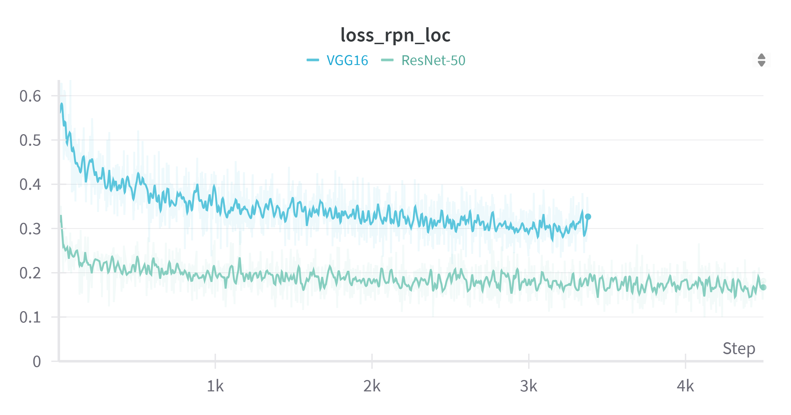

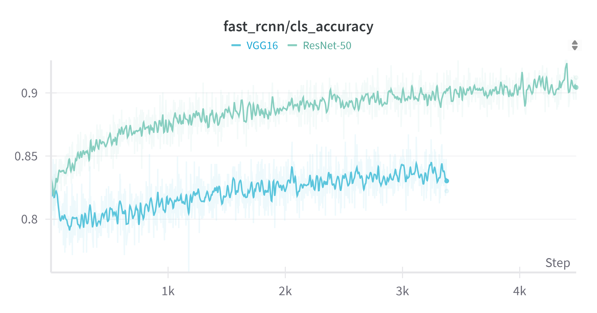

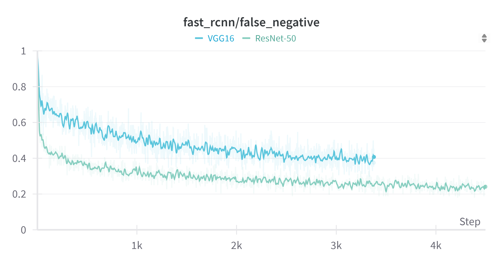

### Summary

It is evident that VGG16's performance is significantly inferior to ResNet50.

Several observations can be made:

1. **Instability in VGG16:**
    - The loss, accuracy, and false negative curves for VGG16 show significant fluctuations, suggesting that VGG16 is less stable compared to ResNet50. The presence of a large number of weights in VGG16 increases its uncertainty, whereas ResNet50 can handle multi-dimensional data more effectively through its bottleneck structure.
2. **Loss Box Regression:**
    - Initially, VGG16 outperforms ResNet50 in terms of loss box regression.
    - However, after a few epochs, the loss box regression for ResNet50 decreases sharply, while that for VGG16 increases significantly. ResNet50, being a Residual Network, avoids gradient vanishing, enabling it to extract finer features through its deeper layers without losing the lower layer features. In contrast, VGG16, with its large number of weights, requires a longer training time and does not perform as well as ResNet50.
3. **Average Precision (AP) for Different Categories:**
    - For categories such as train, bus, and truck, the AP performance is poor.
    - Specifically, the AP for the train category is very low, likely due to the small number of train instances in the dataset. Conversely, the AP for cars is very high, indicating that cars appear frequently in the dataset. Overall, ResNet50 demonstrates significantly better AP across categories compared to VGG16.
        
        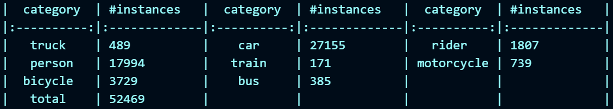
        
4. Diving into AP Comparison
    - Due to ResNet50's use of an FPN (Feature Pyramid Network) as the base architecture, it performs better on small and complex-shaped objects. In the table's `ResNet50 / VGG16` column, we can observe significantly higher accuracy for categories like bicycles and motorcycles.
    - Additionally, it becomes evident that the number of instances does not directly correlate with higher accuracy. For example, despite trucks having 489 instances, the AP for trucks with ResNet50 is 31.3383, while trains, with only 171 instances, achieve an AP of 34.3434 with ResNet50. Overall, while there may be a positive correlation between the number of instances and AP, it is not a strict rule.
        - AP50
            
            
            | category | instances | VGG16 | ResNet50 | ResNet50/VGG16 |
            | --- | --- | --- | --- | --- |
            | truck | 489 | 4.5454 | 31.3383 | 6.8945 |
            | car | 27155 | 25.0299 | 62.6618 | 2.5034 |
            | rider | 1807 | 13.8888 | 51.6960 | 3.7221 |
            | person | 17994 | 11.3173 | 50.9613 | 4.5029 |
            | train | 171 | 0.0 | 34.3434 | NaN |
            | motorcycle | 739 | 4.5454 | 39.8717 | 8.7718 |
            | bicycle | 3729 | 3.5491 | 41.9694 | 11.8253 |
            | bus | 385 | 9.0909 | 49.3398 | 5.4273 |

## Discussion

**Encountered Issues During Implementation**

1. **Detectron2 Version Compatibility with Operating System and CUDA:**
    - Since I was using Windows, I faced compatibility issues with Detectron2 and the required versions of CUDA.
    - To resolve these issues, I used **Windows Subsystem for Linux (WSL)** along with **Conda** for environment management. Successfully installing Detectron2 on WSL with CUDA support required extensive research and referencing multiple resources.
2. **Hardware Resource Limitations:**
    - The default batch size of 16 almost entirely consumed the GPU memory (my GPU has only 4GB), causing each epoch to run very slowly and take a long time to log data to WandB.
    - To address the efficiency and time constraints for visualization, I **reduced the batch size** to 2 and **increased the number of iterations**. This adjustment allowed for faster data logging while maintaining the overall training volume, effectively trading bandwidth for more timely feedback and protecting the hardware from excessive strain.

## Reference

> [CUDA on WSL (nvidia.com)](https://docs.nvidia.com/cuda/wsl-user-guide/index.html#getting-started-with-cuda-on-wsl-2)
[CUDA Toolkit 12.4 Downloads | NVIDIA Developer](https://developer.nvidia.com/cuda-downloads?target_os=Linux&target_arch=x86_64&Distribution=WSL-Ubuntu&target_version=2.0&target_type=deb_local)
[facebookresearch/detectron2: Detectron2 is a platform for object detection, segmentation and other visual recognition tasks. (github.com)](https://github.com/facebookresearch/detectron2)
[Getting Started with Detectron2 — detectron2 0.6 documentation](https://detectron2.readthedocs.io/en/latest/tutorials/getting_started.html#training-evaluation-in-command-line)
[](https://developer.nvidia.com/cuda-downloads?target_os=Linux&target_arch=x86_64&Distribution=WSL-Ubuntu&target_version=2.0&target_type=deb_local)[ResNet50网络结构图及结构详解 - 知乎 (zhihu.com)](https://zhuanlan.zhihu.com/p/353235794)
[直觀理解ResNet —簡介、 觀念及實作(Python Keras) | by Chi Ming Lee | Medium](https://medium.com/@rossleecooloh/%E7%9B%B4%E8%A7%80%E7%90%86%E8%A7%A3resnet-%E7%B0%A1%E4%BB%8B-%E8%A7%80%E5%BF%B5%E5%8F%8A%E5%AF%A6%E4%BD%9C-python-keras-8d1e2e057de2)
[[1512.03385] Deep Residual Learning for Image Recognition (arxiv.org)](https://arxiv.org/abs/1512.03385)
[VGG-16 | CNN model for Classification and Detection - All about Machine Learning (techcraft.org)](https://blog.techcraft.org/vgg-16-cnn-model-for-classification-and-detection/)
[Add VGG backbones by ashnair1 · Pull Request #1584 · facebookresearch/detectron2 (github.com)](https://github.com/facebookresearch/detectron2/pull/1584)
>
